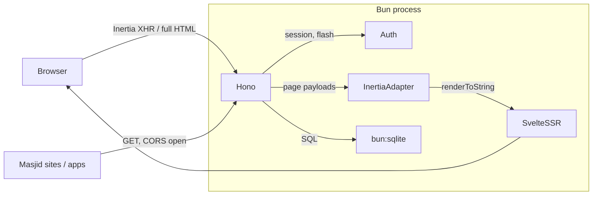

# GlobalHilal

One valid crescent sighting anywhere starts the month for all — a
testimony-based global Hijri calendar with a free public API.

[](LICENSE)
[](https://bun.sh)

**Hono** (HTTP) + **bun:sqlite** (database) + **Inertia v3 / Svelte 5**
(server-driven UI with in-process SSR), running entirely on **Bun**.
Built on the [Dulak](https://github.com/maulanashalihin/dulak) boilerplate
conventions (`AGENTS.md`).



## Methodology

Every date on this site follows five locked rules (see `/methodology`):

1. **A month begins with testimony** (syahadah), per the hadith — fast when
   you see it, break fast when you see it.
2. **One sighting counts worldwide** — a single global horizon; no
   obligation to follow any single country.
3. **Testimony only, never forecasts** — the only forward-looking date is
   the next observation evening (`next_observation_date`).
4. **No day boundary** — a late testimony still makes that day the 1st
   (intraday revision with a warning).
5. **Evidence stays public** — testimonies, references, disputes and
   corrections are all on record, never silently edited.

## Quick start

```bash
bun install
bun run dev          # http://localhost:4000
```

### Scripts

| Command             | What it does                                              |
| ------------------- | --------------------------------------------------------- |
| `bun run dev`       | Watch mode; rebuilds client assets on restart             |
| `bun run build`     | Prebuild client assets → `dist/` (+ `manifest.json`)      |
| `bun run start`     | Serve prebuilt assets (`NODE_ENV=production`)             |
| `bun run test`      | Full suite — `bun test --isolate` (129 tests)             |
| `bun run db:seed`   | Create a user (`[email] [password] [role]` args)          |
| `bun run db:seed-ar`| Backfill Arabic translations for the 1448H archive        |
| `bun run typecheck` | `svelte-check` (0 errors)                                 |

## Public API (no auth, CORS open)

Full interactive docs at `/docs`.

```bash
curl "http://localhost:4000/api/v1/today?tz=Asia/Jakarta"
curl "http://localhost:4000/api/v1/months/1448/4"
```

| Endpoint | Answers |
| --- | --- |
| `GET /api/v1/today[?tz=&date=]` | Today's Hijri date in any IANA timezone |
| `GET /api/v1/convert?gregorian=&tz=` | Hijri date for an explicit Gregorian date |
| `GET /api/v1/months[?hijri_year=&status=]` | Month history, newest first |
| `GET /api/v1/months/current` | The running month + next observation date |
| `GET /api/v1/months/:year/:month` | Full ruling: testimonies + references |

Errors are `{ error: { code, message } }` (`INVALID_TZ`, `INVALID_DATE`,
`NOT_FOUND`, `OUT_OF_RANGE`). Dates beyond confirmed testimony return
`OUT_OF_RANGE` — never predicted. Breaking changes ship as `/v2`.

## Web pages

| URL | Content |
| --- | --- |
| `/`, `/today` | Today's Hijri date (night-sky hero, moon phase, evidence) |
| `/calendar` | 12-month archive grid per Hijri year |
| `/hijri/:key` | Month ruling: decision, testimonies, references, JSON-LD |
| `/methodology`, `/sources`, `/docs` | Rules, source policy, API docs |

Public pages render `{ public: true }` (no user data in HTML) and are cached
at the CDN edge. The admin console (`/dashboard`, `/admin/hijri`) is private.

## Localization (AR/EN)

Public pages are bilingual. The API is **always English** — one contract for
every consumer.

- **Detection order** (`src/server/locale.ts`): `gh_locale` cookie → Cloudflare
  `CF-IPCountry` (22 Arab-League states → Arabic) → `Accept-Language`
  (dev/curl fallback) → English.
- **Switcher**: the navbar dropdown POSTs to `/locale` (native form, works
  without JS) and stores the explicit choice in `gh_locale` for a year. The
  cookie always wins; deleting it restores the geo default.
- **URLs stay single**: no `?lang=` and no `/ar/` prefix. The server renders
  `lang`/`dir` (RTL for Arabic) and `Content-Language` per request; `Vary:
  CF-IPCountry, Cookie, Accept-Language` documents the inputs.
- **Editorial content** carries optional `_ar` columns (`decision_summary_ar`,
  `note_ar`, `title_ar`, `quote_ar`). Empty means "not translated yet" and the
  page falls back to the English text. The admin console shows a warning (never
  blocks publishing) when a published month has no Arabic.
- **Numerals**: public pages render Arabic-Indic digits (٠١٢٣٤٥٦٧٨٩) in Arabic;
  forms, month keys, URLs and code samples keep Western digits.
- **Places**: `country`/`city` stay free text in the DB (proper nouns); Arabic
  pages map the known names at render time (`src/client/i18n/places.ts`) and
  fall back to the stored text for anything unmapped.
- **Backfill**: months seeded before migration 0010 get their Arabic via
  `bun run db:seed-ar` (idempotent, matches rows by `month_key`, country +
  sighting date, and reference URL; never creates content).
- UI copy lives in `src/client/i18n/{en,ar}.ts` — `Dict` is derived from `en`,
  so a missing Arabic key fails `bun run typecheck`.

### Cloudflare setup (required in production)

1. **Network → IP Geolocation = ON** — without it `CF-IPCountry` is not sent.
2. **Cache Rule** for the site: Cache Key → include header `CF-IPCountry` and
   cookie `gh_locale` (the specific cookie name, not the whole `Cookie`
   header); keep the query string (so the Inertia `_spa=1` payload stays a
   separate key). Cloudflare ignores `Vary` for its own cache key, so this rule
   is what keeps Arabic and English HTML in separate edge entries.
3. Verify:
   `curl -sI -H 'CF-IPCountry: SA' https://globalhilal.org/today` →
   `content-language: ar`; repeat with `-H 'Cookie: gh_locale=en'` → `en`.
4. SEO note: crawlers carry no cookie and are not in an Arab country, so they
   index the English version; the Arabic variant has no separate URL by design.

## Editorial workflow

Editors publish monthly rulings at `/admin/hijri` (admin role): create the
draft → record testimonies (`sighting_reports`) → attach ruling references
(`month_references`) → publish (`provisional` → `confirmed`). Publishing is
blocked without a verified sighting; drafts are invisible to the public;
corrections append history via `corrected`. Disputes (e.g. one country
sighting, another cloudy) are recorded as `not_seen` rows, not hidden.

## Configuration (.env)

| Variable | Default | Notes |
| --- | --- | --- |
| `PORT` | `4000` | In dev, auto-increments to the next free port if busy (prod fails fast) |
| `APP_URL` | `http://localhost:4000` | Absolute base URL (sitemap, OAuth redirects) |
| `DATABASE_PATH` | `./data/app.sqlite` | |
| `SSR` | `true` | `false` ships an empty shell — client renders from scratch (no hydrate) |
| `MAIL_DRIVER` | `log` | `log` \| `resend` \| `mailtrap` |
| `MAIL_FROM` | `no-reply@example.com` | |
| `RESEND_API_KEY` | — | required when `MAIL_DRIVER=resend` |
| `MAILTRAP_API_TOKEN` | — | required when `MAIL_DRIVER=mailtrap` |
| `MAILTRAP_INBOX_ID` | — | use the sandbox endpoint when set |
| `GOOGLE_CLIENT_ID` / `GOOGLE_CLIENT_SECRET` | — | enable Google OAuth (both or none) |
| `RATE_LIMIT_GLOBAL_MAX` / `RATE_LIMIT_GLOBAL_WINDOW` | `200` / `60` | per-IP requests per window on all routes (excludes `/health`, `/assets/*`) |
| `RATE_LIMIT_AUTH_MAX` / `RATE_LIMIT_AUTH_WINDOW` | `30` / `60` | stricter per-IP limit on auth endpoints (brute-force protection) |
| `RATE_LIMIT_API_MAX` / `RATE_LIMIT_API_WINDOW` | `600` / `60` | generous per-IP limit on the public read-only API (`/api/v1/*`) |
| `UPLOAD_DIR` | `./data/uploads` | tus upload bytes on disk |
| `TUS_MAX_SIZE` | `0` | max upload size in bytes (`0` = unlimited) |
| `TUS_EXPIRATION_SECONDS` | `0` | unfinished upload TTL in seconds (`0` = no expiry) |
| `METRICS_TOKEN` | — | bearer token for `/metrics`; if unset, `/metrics` is restricted to loopback only |

Invalid/incomplete config fails fast at startup with a clear message
(`src/server/config.ts`).

### Google OAuth setup

1. [Google Cloud Console](https://console.cloud.google.com/apis/credentials) →
   create OAuth client (Web application).
2. Authorized redirect URI: `https://<your-domain>/auth/google/callback`
   (`http://localhost:4000/auth/google/callback` for local dev).
3. Set `GOOGLE_CLIENT_ID` and `GOOGLE_CLIENT_SECRET` in `.env`.

### Mail drivers

- **log** (default): prints a formatted message and records it in
  `sentMails` — usable in dev and asserted in tests.
- **resend**: set `RESEND_API_KEY` (`MAIL_DRIVER=resend`).
- **mailtrap**: set `MAILTRAP_API_TOKEN` (`MAIL_DRIVER=mailtrap`); add
  `MAILTRAP_INBOX_ID` to use the sandbox endpoint.

## Architecture

AI agents: follow [`AGENTS.md`](AGENTS.md) — it codifies the layout rules
below so new code stays structurally consistent.

```
src/
├── index.ts                # entry: build assets (dev), Bun.serve, graceful shutdown
├── server/
│   ├── app.ts              # composition + onError/notFound, /health, /metrics, /robots.txt, /sitemap.xml
│   ├── config.ts           # validated env config (fails fast)
│   ├── db.ts               # bun:sqlite: connection, prepared statements
│   ├── hijri.ts            # domain logic + public serializers (shared by API and pages)
│   ├── locale.ts           # AR/EN resolution (cookie → CF-IPCountry → Accept-Language)
│   ├── migrations.ts       # SQL migration runner
│   ├── auth.ts             # argon2id, sessions, flash, cookies, reset tokens, guards
│   ├── inertia.ts          # Inertia v3 server adapter (SSR shell, XHR, 409)
│   ├── inertia-middleware.ts # per-request session resolve → c.var (AppEnv)
│   ├── validation.ts       # TypeBox JSON validation → ValidationFailed (422)
│   ├── mailer.ts           # mail drivers: log / resend / mailtrap
│   ├── rate-limit.ts       # in-memory fixed-window rate limiter (paths + prefixes)
│   ├── logger.ts           # request logging + x-request-id
│   ├── security.ts         # CSRF origin check (headers via hono/secure-headers)
│   ├── url.ts              # defensive request-URL parsing
│   ├── assets.ts           # Bun.build pipeline + manifest + static serving
│   ├── tus-protocol.ts     # tus v1 protocol constants & helpers
│   ├── tus-storage.ts      # tus upload bytes on disk (data/uploads)
│   └── routes/
│       ├── hijri-api.routes.ts    # /api/v1/* (public JSON, CORS, rate limit)
│       ├── hijri.routes.ts        # public pages: /today, /calendar, /hijri/:key, /methodology, /sources, /docs
│       ├── locale.routes.ts       # /locale (language switcher: cookie + redirect)
│       ├── admin-hijri.routes.ts  # /admin/hijri* (editorial console, admin role)
│       ├── api.routes.ts          # /api/session (user identity for public pages)
│       ├── auth.routes.ts         # /login /register /logout /forgot/reset (GET+POST)
│       ├── google-oauth.routes.ts # /auth/google, /auth/google/callback
│       ├── pages.routes.ts        # app-shell pages: /, /dashboard, /admin
│       ├── profile.routes.ts      # /profile page + /profile/avatar (multipart + Bun.Image)
│       └── uploads.routes.ts      # /uploads* (tus resumable upload)
├── client/
│   ├── app.ts              # Inertia client bootstrap (hydrate or mount)
│   ├── ssr.ts              # in-process SSR renderer (svelte/server)
│   ├── pages.ts            # explicit page registry (shared by SSR + bundle)
│   ├── i18n/               # AR/EN dictionaries + Arabic-Indic digit formatting
│   ├── pages/              # Home, Today, Calendar, MonthDetail, Methodology,
│   │                       # Sources, Docs, Dashboard, AdminHijri(+Detail), …
│   ├── components/         # PublicLayout, Layout, AuthLayout, Brand, Field,
│   │                       # Crescent (moon phase), Stars, StatusBadge (.svelte)
│   ├── tailwind.css        # @import tailwindcss + @theme inline (token bridge)
│   └── styles.css          # design-token CSS variables + @keyframes only
├── shared/
│   ├── types.ts            # User, HijriMonth, TodayData, MonthDetailJson, …
│   └── inertia.d.ts        # InertiaConfig augmentation → typed props.auth
├── migrations/             # versioned SQL schema files (0001–0008)
├── tests/                  # bun:test suite, one file per area (in-memory DB)
└── scripts/                # build.ts, seed.ts
```

## How the pieces fit

- **Request lifecycle**: `requestLogger` (correlation id) → `checkOrigin`
  (CSRF) → `secureHeaders` → inertia session resolve → global rate limit →
  guards + handler → Inertia render (SSR HTML for browsers, JSON for
  `X-Inertia` XHR) → `onError` (422 validation with friendly field
  messages, 500) / `notFound` (404 Inertia page).
- **Hijri date resolution** (`hijri.ts` + `db.ts`): months resolve from
  `start_gregorian` ordering; open-ended months cap at 30 days — the future
  is never forecast (`OUT_OF_RANGE`). Drafts are excluded from every public
  surface via `listPublic*` statements. One serializer feeds both the API
  and the pages so they cannot diverge.
- **Auth**: argon2id via `Bun.password`; 256-bit random session tokens in
  SQLite; cookies httpOnly/`SameSite=Lax`/Secure-in-prod. Logout deletes the
  session row server-side. `passwordHash` never leaves the server.
- **Guards** are Hono middleware: `requireAuth`, `guestOnly`,
  `requireRole('admin')` (non-admins redirect to `/dashboard`).
- **Rate limiting** is an in-memory fixed-window limiter keyed by
  `X-Forwarded-For`/peer IP. Three layers: global (DDoS baseline), auth
  (brute-force), public API `/api/v1/*` (generous 600/60 via `prefixes`).
- **Validation**: TypeBox schemas at the route level; `onError` maps
  `ValidationFailed` to 422 Inertia page payloads.
- **Asset versioning**: `Bun.build` emits content-hashed files; the hash is
  the Inertia `version`. Stale clients get a 409 and reload.

## Database migrations

Schema changes are plain SQL files in `migrations/`, applied automatically at
startup in filename order, each inside a transaction, recorded in
`schema_migrations` (never re-applied).

Rules:

- **Never edit an applied migration** — add a new numbered file instead.
- SQLite `ALTER TABLE ADD COLUMN` with `NOT NULL` requires a `DEFAULT`.
- A failed migration rolls back and aborts startup.

## Testing

```bash
bun test --isolate   # or: bun run test
```

129 tests across 9 files: auth/roles/reset/Inertia/CSRF, tus uploads, avatar
upload, Hijri domain logic, public API v1 (incl. rate-limit 429 and draft
invisibility), public pages (SSR + cache + sitemap), admin console (guards,
CRUD, publish rule), locale resolution + bilingual pages (AR/EN, digits,
`/locale`, API-stays-English regression). Each file boots the app against an
in-memory DB; `--isolate` is required (suites set env in `beforeAll`,
`db.close()` in `afterAll`).

Browser verification uses `playwright-cli` (global agent rule) — login,
admin CRUD walkthroughs, and console checks.

## Deployment

```bash
docker compose up -d --build
```

- Multi-stage `Dockerfile` (`oven/bun:1.4-alpine`): assets prebuilt in the
  build stage, production deps only at runtime. Non-root user, `./data`
  volume for SQLite, healthcheck on `/health`.
- Set `APP_URL=https://globalhilal.org`, mount the `./data` volume with
  daily backups, and put Cloudflare (or equivalent) in front for TLS + edge
  caching of the public pages/API.

Alternatives: `bun build --compile` for a single binary, or plain
`bun run start` behind your process supervisor (it handles SIGTERM
gracefully).

## Styling

**Tailwind CSS v4** — utility classes in Svelte components. Base tokens
(`--bg`, `--text`, …) plus the GlobalHilal observatory palette (`--gh-sky`,
`--gh-ink`, `--gh-gold`, …) live in `src/client/styles.css`, bridged via
`@theme inline` in `src/client/tailwind.css`. Dark mode uses
`[data-theme="dark"]` on `<html>`. `styles.css` holds only tokens +
`@keyframes`; new styling is new utilities in the component.

## Notes / decisions

- **Bun 1.4+ required** — avatar upload uses `Bun.Image`.
- **Testimony over tables**: when moon-sighting testimony and calculated
  calendars (e.g. Umm al-Qura) disagree, this site follows the testimony and
  records the difference in `decision_summary_en`. Precedent: Rabi' al-Thani
  1448 began 13 Sep 2026 by istikmal (no 11 Sep testimony found anywhere),
  one day after the calculated table.
- **Seed integrity**: month data is never fabricated — every row anchors to
  a real reference. Chain rule: month N's `end` + 1 day must equal month
  N+1's `start` (the admin console shows a chain-check hint).
- `import.meta.glob` was removed from Bun 1.3 — the page registry uses
  explicit imports.
- In dev, `bun --watch` rebuilds client assets on every change; an
  already-open tab does one 409 + full page reload after a rebuild.
- `X-Forwarded-For` is trusted for rate limiting — only run behind a proxy
  that sets it.
- gzip uses `node:zlib` (`compress.ts`), not the Web `CompressionStream`.
- Hono gotchas handled: HEAD→GET conversion, `c.header()` dropped on custom
  `Response` (cookie helpers append to `c.res.headers`), `/*` wildcard has
  no named param, `hono/conninfo` ESM stub (peer IP read from `c.env`).
